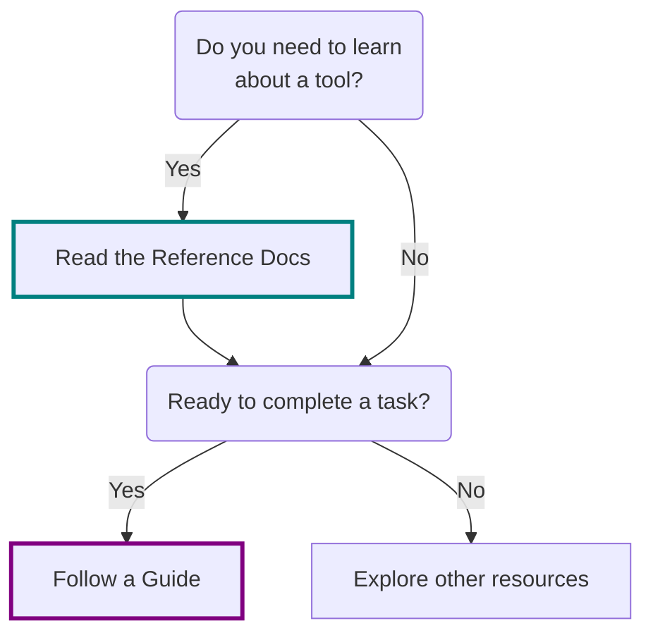

## Reference Docs vs. Guides

Reference docs explain what a tool is and why it's used, while guides provide step-by-step instructions for completing specific tasks once you're ready to take action.

<!--- 
- **Reference Docs** provide high-level information and context about an application or tool. They explain what the tool is, its purpose, and how it fits into the broader system or workflow. These docs are ideal for users who are trying to understand or learn about the tool at a conceptual level.
- **Guides** focus on action-oriented, step-by-step instructions to accomplish specific tasks. They assume the reader already understands the basics of the tool from the overview docs and is ready to perform a particular operation or workflow.

**When to use each:**
Start with the **reference docs** to gain foundational knowledge about an application or tool. Then, refer to a **guide** when you need detailed steps to complete a specific task.
--->

### Reference Docs

**Reference Docs** provide high-level information and context about an application or tool. They explain what the tool is, its purpose, and how it fits into the broader system or workflow. These docs are ideal for users who are trying to understand or learn about the tool at a conceptual level.

### Guides

**Guides** focus on action-oriented, step-by-step instructions to accomplish specific tasks. They assume the reader already understands the basics of the tool from the overview docs and is ready to perform a particular operation or workflow.

<!--- 
???+ note

    Read through the [MkDocs "Writing your docs" guide](https://www.mkdocs.org/user-guide/writing-your-docs/) and the [Material for MkDocs "Reference" guide](https://squidfunk.github.io/mkdocs-material/reference/){:target="_blank"} for more information about using [Material for MkDocs](https://squidfunk.github.io/mkdocs-material/){:target="_blank"}.
--->

## Which doc should I read?

**When to use each?**

Start with the **reference docs** to gain foundational knowledge about an application or tool. Then, refer to a **guide** when you need detailed steps to complete a specific task.

!!! tip "Guides vs Reference docs"

    Reference docs explain what a tool is and why it's used, while guides provide step-by-step instructions for completing specific tasks once you're ready to take action.

!!! example "Munchkin Short Rules"

    The "**Munchkin Short Rules**" page is a reference doc.

### A visual way to decide which doc to read

If you are a visual learner, here is a visual way to decide which doc to read:

