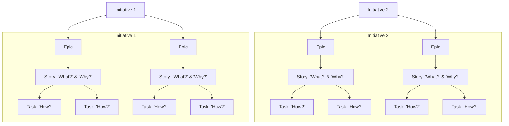

In distributed teams, having a shared understanding of Agile terminology is essential to working effectively. This post explains the hierarchy of Agile work items and how they fit together to support clarity, alignment, and execution.

## 🧩 Work Item Hierarchy Overview

## 📝 Definitions

| Level          | Description                                                                |
|:--------------:|:---------------------------------------------------------------------------|
| **Task**       | The **"how?"** – implementation-level steps proving stories are fulfilled. |
| **Story**      | The **"what?"** and **"why?"** – user-centric requirements with criteria.  |
| **Epic**       | A collection of related stories forming a larger feature.                  |
| **Initiative** | Strategic objective spanning multiple epics.                               |

### Quick Analogy:

> **Stories = Requirements**.
> **Tasks = Implementation.**

## 🌍 Why It Matters for Distributed Teams

- ✍️ **Shared Vocabulary**: Avoids confusion across locations.
- 🎯 **Goal Alignment**: Connects daily work to strategic initiatives.
- 🔍 **Traceability**: Tasks trace back to story requirements.

For a deeper, evolving reference guide, [see the work hierarchy reference file](../../../references/agile-work-hierarchy.md).

