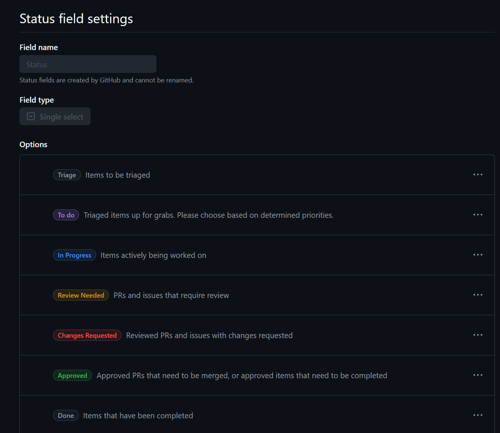

???+ note

    While this document is ***not in draft mode*** it is definitely not complete...

Being flexible and efficient can make working in a distributed team a great experience; sometimes though, you have to be the agent of change to help your team get there.  While trying to understand what Scrumban actually is, it seemed best to type it up myself to reinforce what I have learned so far.

Scrumban combines two leading Agile methodologies—Scrum and Kanban—into a single process for getting work done. But what is scrumban? And why should you consider its unique approach?

These are notes based on the following resources:

- [Understanding the 4 Agile ceremonies][10]
- [Scrumban: Mastering two Agile methodologies][20]

### What is Scrumban?

<!--- https://www.atlassian.com/agile/project-management/scrumban --->
The [Scrumban methodology][20] combines the best features of Scrum and Kanban into a hybrid project management framework. It uses Scrum's stable structure of sprints, standups, and retrospectives. Then it adds Kanban's visual workflow and work-in-progress limitations. The result is a truly flexible method for managing projects of any size.

## Agile Ceremonies

<!--- https://asana.com/resources/agile-scrum-ceremonies --->
An [Agile ceremony][10] is an event in the [Agile process][11] when your team meets to discuss what their next course of action is.

There are four major Agile ceremonies that happen during every sprint cycle. Before starting each ceremony, your team members should understand the purpose of each meeting and how it impacts the sprint.

### The 4 Agile ceremonies

1. The sprint planning meeting
2. The daily [stand-up meeting][30]
3. The sprint review meeting
4. The sprint retrospective meeting

## Intentionally timely

### Timeboxed meetings

As mentioned in the [stand-up meeting][30] wikipedia page, the [stand-up meetings][30] are intentionally timeboxed:
> The meetings are usually [timeboxed][31] to between 5 and 15 minutes, and take place with participants standing up to remind people to keep the meeting short and to-the-point.[6][32]

### Keep the meeting short

> The daily stand-up meeting (also known as a “daily scrum”, a “daily huddle”, “morning roll-call”, etc.) is simple to describe:
> 
> The whole team meets every day for a quick status update. We stand up to keep the meeting short.
> 
> That's it.
> 
> But this short definition does not really tell you the subtle details that distinguish an effective stand-up from a waste of time.
> 
> So how can you tell?

The answer to the question of an effective stand-up is addressed in the [It's Not Just Standing Up: Patterns for Daily Standup Meetings][32] article, which is linked from the [stand-up meeting][30] wikipedia page.

## The Kanban board

[GitHub projects][40] offers one way to use a Kanban board, this is accomplished using [custom views in your GitHub project][41], specifically the [board layout][42], which is based on the **status field**.

#### Example status field settings

Here is an example of **Status field settings** for a GitHub project:

- **Triage**: Items to be triaged
- **To do**: Triaged items up for grabs. Please choose based on determined priorities.
- **In Progress**: Items actively being worked on
- **Review Needed**: PRs and issues that require review
- **Changes Requested**: Reviewed PRs and issues with changes requested
- **Approved**: Approved PRs that need to be merged, or approved items that need to be completed
- **Done**: Items that have been completed

Here is what that would look like in the **Status field settings** page:

### Using GitHub project workflows to improve timeliness

To be continued

<!--- ## End --->

[10]: <https://asana.com/resources/agile-scrum-ceremonies> "Understanding the 4 Agile ceremonies"
[11]: https://asana.com/resources/agile-methodology
[20]: <https://www.atlassian.com/agile/project-management/scrumban> "Scrumban: Mastering two Agile methodologies"
[30]: https://en.wikipedia.org/wiki/Stand-up_meeting
[31]: https://en.wikipedia.org/wiki/Timeboxing
[32]: https://www.martinfowler.com/articles/itsNotJustStandingUp.html
[40]: https://docs.github.com/en/issues/planning-and-tracking-with-projects
[41]: https://docs.github.com/en/issues/planning-and-tracking-with-projects/customizing-views-in-your-project
[42]: https://docs.github.com/en/issues/planning-and-tracking-with-projects/learning-about-projects/quickstart-for-projects#adding-a-board-layout

<!--- [999]: https://asana.com/resources/what-is-scrum --->
