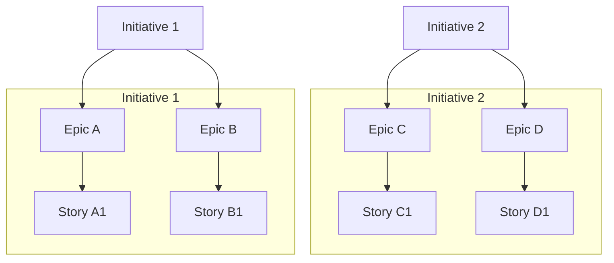

???+ note

    This is meant to be a visual overview of how to manage 
    issues as part of an overall work tracking process.

<!--- ## Work Tracking --->

As mentioned in the [_Using Scrumban in a distributed team_](./distributed-team-using-scrumban.md) post, using Sprints to plan and define the work that will be completed can be extremely helpful in a distributed team. 
There _should be_ a formally established process to follow in order to help everyone understand expectations. 
In this scenario, we can find out how we can use [GitHub issues to plan and track work][01] which can be helpful given the [recent changes the GitHub team is making to issues and projects][02].

<!--- 
References for later:

- https://www.atlassian.com/agile/scrum/sprint-planning
- https://www.atlassian.com/software/jira/templates/sprint-backlog
- https://www.atlassian.com/agile/project-management/workflow
- https://www.atlassian.com/agile/project-management/epics-stories-themes
- https://medium.com/agile-adapt/how-to-plan-your-agile-projects-with-epics-and-milestones-d80287ca730e

--->

### Agile Project Management Terminology

<!--- from https://www.atlassian.com/agile/project-management/epics-stories-themes --->

What are stories, epics, and initiatives? (from [`atlassian.com`][11])

- [**Stories**][12], also called “user stories,” are short requirements or requests written from the perspective of an end user.
- [**Epics**][13] are large bodies of work that can be broken down into a number of smaller tasks (called stories).
- **Initiatives** are collections of epics that drive toward a common goal.

<!--- A visual overview of how we manage issues as part of our overall work tracking process. --->

### Including Tasks to use with GitHub Projects

We can build on the [Agile project management terminology](#agile-project-management-terminology) by adding [tasks](./agile-story-vs-task.md) as a subset of ***either*** a story or an epic.
The differences are explained more in the [_Agile Story vs Task_ post](./agile-story-vs-task.md) and the [_Understanding Agile Work Hierarchy_ post](./agile-hierarchy.md).

For a deeper, evolving reference guide, [see the **Agile Work Hierarchy Reference** page](../../../references/agile-work-hierarchy.md).

<!--- ## End --->

[01]: https://docs.github.com/en/issues/tracking-your-work-with-issues/configuring-issues/planning-and-tracking-work-for-your-team-or-project
[02]: https://github.blog/changelog/2025-04-09-evolving-github-issues-and-projects/
[11]: <https://www.atlassian.com/agile/project-management/epics-stories-themes> "Stories, epics, and initiatives"
[12]: https://www.atlassian.com/agile/project-management/user-stories
[13]: https://www.atlassian.com/agile/project-management/epics
[90]: https://www.atlassian.com/agile/project-management/workflow
[91]: https://www.atlassian.com/software/jira/templates/sprint-backlog
[92]: https://medium.com/agile-adapt/how-to-plan-your-agile-projects-with-epics-and-milestones-d80287ca730e

<!--- [999]: https://asana.com/resources/what-is-scrum --->
