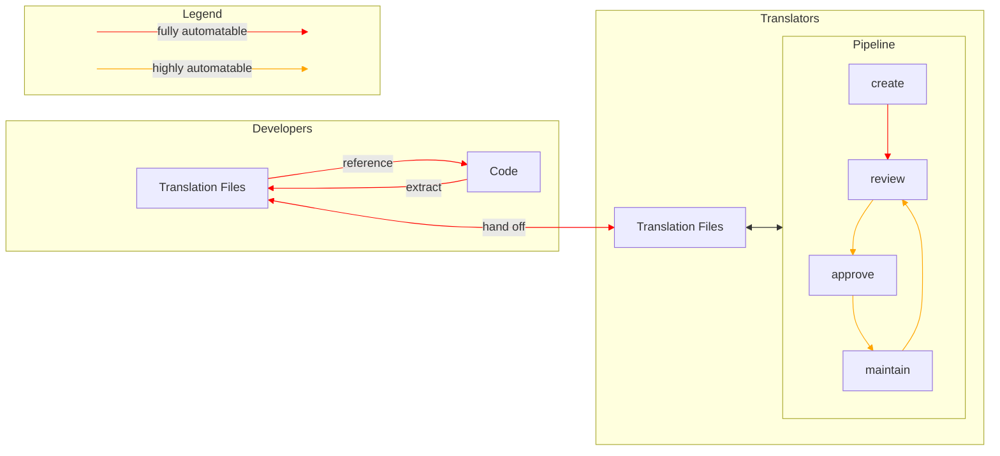

<!---  # Legends in mermaid diagrams  --->
<!---  do not put an actual 'heading 1' if it is the same as the title  --->

It might be helpful to add a legend to graphs using [Mermaid](https://github.com/mermaid-js/mermaid).

## Support for Legends in a Graph

Here are some examples to test workarounds for legends in a graph from [mermaid-js/mermaid#2110](https://github.com/mermaid-js/mermaid/issues/2110)


### Legends in a Graph Example 1

<!--- source https://github.com/mermaid-js/mermaid/issues/2110#issuecomment-1057895108 --->

This is from [mermaid-js/mermaid#2110 comment 1057895108](https://github.com/mermaid-js/mermaid/issues/2110#issuecomment-1057895108):




### Legends in a Graph Example 2

<!--- source https://github.com/mermaid-js/mermaid/issues/2110#issuecomment-2696764562 --->

This is from [mermaid-js/mermaid#2110 comment 2696764562](https://github.com/mermaid-js/mermaid/issues/2110#issuecomment-2696764562):


```mermaid
    subgraph B[ ]
        direction TB
        minutes(("<p style='width:0rem;height:1rem;margin:0px;'>&emsp;&emsp; minutes</p>"))
        hours(("<p style='width:0rem;height:1rem;margin:0px;'>&emsp;&emsp; hours</p>"))
        days(("<p style='width:0rem;height:1rem;margin:0px;'>&emsp;&emsp; days</p>"))
        weeks(("<p style='width:0rem;height:1rem;margin:0px;'>&emsp;&emsp; weeks</p>"))
        minutes ~~~ hours ~~~ days ~~~ weeks
        style minutes fill:#b877d9,stroke-width:0px
        style hours fill:#a352cc,stroke-width:0px
        style days fill:#8f3bb8,stroke-width:0px
        style weeks fill:#7c2ea3,stroke-width:0px
    end
```

<!--  example comment here  -->
<!--- another example comment --->

<!---  ...  --->
