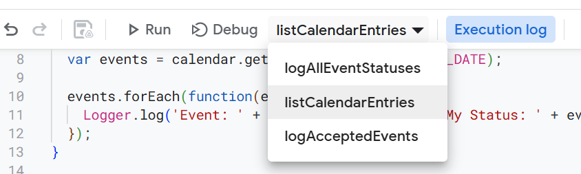

<!---  # Personal time tracking  --->
<!---  do not put an actual 'heading 1' if it is the same as the title  --->

Notes about self-tracking time spent on different projects each week using different tools.

### Review Slack messages sent during the week

Within Slack, you can search for messages you have sent using the following:

- `from:@SlackUsername`
- `before:2025-02-08`
- `after:2025-02-02`

The actual query would be:
```shell
from:@SlackUsername before:2025-02-08 after:2025-02-02
```

### Review GitHub commits during the week

[GitHub Docs - Searching commits](https://docs.github.com/en/search-github/searching-on-github/searching-commits)

Get a list of commits [by author or committer](https://docs.github.com/en/search-github/searching-on-github/searching-commits#search-by-author-or-committer):
```shell
# using the 'author'
https://github.com/search?q=author%3Agithubusername&type=commits&s=committer-date&o=desc&p=1
# using the 'committer'
https://github.com/search?q=committer%3Agithubusername&type=commits&s=committer-date&o=desc
# using the 'committer-name'
https://github.com/search?q=committer-name%3Agithubusername&type=commits&s=committer-date&o=desc
```

Try to use the date ranges to get a list of commits, [by authored or committed date](https://docs.github.com/en/search-github/searching-on-github/searching-commits#search-by-authored-or-committed-date):
```shell
https://github.com/search?q=author%3Agithubusername&type=commits&s=committer-date&created%3A%3E2025-02-07&o=desc
```

Other syntax to try:
```shell
author-date%3A<2025-02-02&type=Commits

author-date
author-date:>2016-01-01

https://github.com/search?q=created%3A%3E2025-02-07&type=Repositories&ref=advsearch&l=&l=
```


### Using your Google Calendar to keep track of time

If you use Google Calendar, you can also use Google Apps Script to print a list of calendar events for a specified date range.

- Create a new project in [Google Apps Script](https://script.google.com/), you can name it `Calendar info`
- In the project, create a new file named `CalendarEntries`
- Add the following functions:

```js
// Global variables
var START_DATE = new Date('2025-02-23');
var END_DATE = new Date('2025-03-01');  // End date is exclusive, be sure to pick the date AFTER you want to search through
var CALENDAR_ID = 'myemail@gmail.com';

function logAllEventStatuses() {
  var calendar = CalendarApp.getCalendarById(CALENDAR_ID);
  var events = calendar.getEvents(START_DATE, END_DATE);
  
  events.forEach(function(event) {
    Logger.log('Event: ' + event.getTitle() + ', My Status: ' + event.getMyStatus());
  });
}

function listCalendarEntries() {
  var calendar = CalendarApp.getCalendarById(CALENDAR_ID);
  var events = calendar.getEvents(START_DATE, END_DATE);

  Logger.log('Total events retrieved: ' + events.length);

  // Group events by date
  var eventsByDate = {};
  events.forEach(function(event) {
    var dateStr = Utilities.formatDate(event.getStartTime(), Session.getScriptTimeZone(), 'yyyy-MM-dd');
    if (!eventsByDate[dateStr]) {
      eventsByDate[dateStr] = [];
    }
    // Calculate duration in hours as a decimal
    var durationHours = (event.getEndTime() - event.getStartTime()) / (1000 * 60 * 60);
    eventsByDate[dateStr].push(`${event.getTitle()} (Duration: ${durationHours} hours)`);
  });
  
  // Create a text output grouped by date
  var output = '';
  Object.keys(eventsByDate).sort().forEach(function(date) {
    output += date + ':\n';
    eventsByDate[date].forEach(function(eventText) {
      output += ' - ' + eventText + '\n';
    });
    output += '\n';
  });
  
  Logger.log(output);
}

function logAcceptedEvents() {
  // this function does not work as intended yet, need to find out the proper 'myStatus' filter 
  //
  // For this function, you can decide if you want to use a different date range.
  // For now, we'll reuse the global dates.
  var calendar = CalendarApp.getCalendarById(CALENDAR_ID);
  var events = calendar.getEvents(START_DATE, END_DATE);

  Logger.log('Total events retrieved: ' + events.length);
  
  events.forEach(function(event) {
    var myStatus = event.getMyStatus();
    // Filter events that are either owned or accepted
    if (myStatus === 'OWNER' || myStatus === 'YES' || myStatus === 'accepted') {
      Logger.log('Accepted Event: ' + event.getTitle() +
                 ' | Start: ' + event.getStartTime() +
                 ' | End: ' + event.getEndTime() +
                 ' | Status: ' + myStatus);
    }
  });
}
```

- Update the `CALENDAR_ID` with your email address
- Update the `START_DATE` to the first day you want to get calendar entries for
- Update the `END_DATE` to the date **AFTER** you want to search through
    - Example: if you want to search **through** `2025-03-01`, then enter `2025-03-02`
- Save the changes to the `CalendarEntries` file


#### Running the listCalendarEntries function

Once you have stored your email address in the `CALENDAR_ID` and updated the `START_DATE` and `END_DATE` variables, now you can run the **listCalendarEntries** function:

- Confirm the variables have been set correctly
- Select the `listCalendarEntries` in the drop down menu
- Select the **Run** option in the menu



