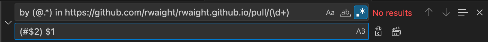
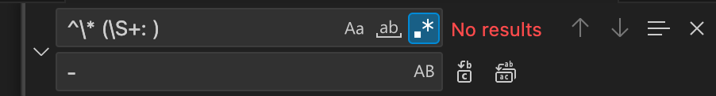

---
# page configuration
title: Blog post template
description: >
  This is a template file for blog posts in MkDocs.
icon: octicons/repo-template-24
status: new
# page metadata
draft: true
date:
  created: 2025-06-05
  updated: 2025-06-05
authors:
  - rwaight
categories:
  - MkDocs
slug: blog-post-template
tags:
  - MkDocs
  - Template
---


### Change formatting for Pull Request entries

**Find**:
```shell
by (@.*) in https://github.com/rwaight/rwaight.github.io/pull/(\d+)
```

**Replace**:
```shell
(#$2) $1
```




### Replace the commit message type

**Find**:
```shell
^\* (\S+: )
```

**Replace**:
```shell
- 
```


