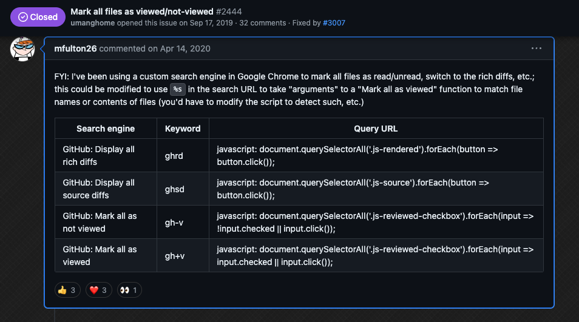

# Random GitHub notes


### Marking all PR files as viewed in the GitHub Web UI

The "marking all files as viewed" might be fixed in [https://github.com/refined-github/refined-github/issues/3043](https://github.com/refined-github/refined-github/issues/3043)

From [https://github.com/refined-github/refined-github/issues/2444#issuecomment-613557336](https://github.com/refined-github/refined-github/issues/2444#issuecomment-613557336)

> FYI: I've been using a [custom search engine in Google Chrome](chrome://settings/searchEngines) to mark all files as read/unread, switch to the rich diffs, etc.; this could be modified to use `%s` in the search URL to take "arguments" to a "Mark all as viewed" function to match file names or contents of files (you'd have to modify the script to detect such, etc.)

| Search engine                    | Keyword | Query URL                                                                                                             |
| -------------------------------- | ------- | --------------------------------------------------------------------------------------------------------------------- |
| GitHub: Display all rich diffs   | ghrd    | `javascript: document.querySelectorAll('.js-rendered').forEach(button => button.click());`                            |
| GitHub: Display all source diffs | ghsd    | `javascript: document.querySelectorAll('.js-source').forEach(button => button.click());`                              |
| GitHub: Mark all as not viewed   | gh-v    | `javascript: document.querySelectorAll('.js-reviewed-checkbox').forEach(input => !input.checked \|\| input.click());` |
| GitHub: Mark all as viewed       | gh+v    | `javascript: document.querySelectorAll('.js-reviewed-checkbox').forEach(input => input.checked \|\| input.click());`  |

_Originally posted by @mfulton26 in [https://github.com/refined-github/refined-github/issues/2444#issuecomment-613557336](https://github.com/refined-github/refined-github/issues/2444#issuecomment-613557336)_

#### screenshot



## Managing GitHub Secrets in multiple repos

### Managing GitHub Secrets with the GitHub CLI

**GitHub CLI docs**:
- https://cli.github.com/manual/gh_secret
- https://cli.github.com/manual/gh_secret_list
- https://cli.github.com/manual/gh_secret_set
- https://cli.github.com/manual/gh_secret_delete


#### Listing secrets

List secret keys for the current repository:
```bash
gh secret list
```

List secret keys for a specific organization:
```bash
gh secret list --org organization
```

List secret keys for a specific repository:
```bash
gh secret list --repo owner/repository
```

#### Setting secrets

Set a secret for the current repository (user will be prompted for the value):
```bash
gh secret set name
```

Set a secret from a file for the current repository:
```bash
gh secret set name < /path/to/file
```

Set an organization secret for specific repositories:
```bash
gh secret set name --org organization --repos repository1,repository2
```

#### Removing secrets

Remove a secret for the current repository:
```bash
gh secret remove name
```

Remove a secret for a specific organization:
```bash
gh secret remove name --org organization
```

### Using bash to update repos in bulk

```bash
typeset -A myRepos=("rwaight/actions" "rwaight/test-actions" "rwaight/rwaight.github.io")
typeset -A myRepos=(
[0]="rwaight/actions"
[1]="rwaight/test-actions"
[2]="rwaight/rwaight.github.io"
)
for str in "${myRepos[@]}"; do echo "the repo is $str "; done
#secretName="SECRET_NAME_HERE"
#tempSecretNameValue="VALUE_FOR_SECRET_HERE"

typeset -A myRepos=(
[0]="actions"
[1]="test-actions"
[2]="rwaight.github.io"
)

for i in "${myRepos[@]}"; do echo "the repo is rwaight/$i "; done

## now loop through the above array
for repo in "${myRepos[@]}"
do
   #echo "updating secret ${secretName} in repo ${repo}"
   # or do whatever with individual element of the array
   #gh secret set ${secretName} --repo ${repo} --body "${tempSecretNameValue}"
   #
   echo "updating secrets in repo ${repo} using the .env file "
   # use the '.env' file instead
   gh secret set -f .env --repo ${repo}

done
```

## Managing GitHub Secrets with GitHub Actions

To add a GitHub secret to another repository using GitHub Actions, you'll need to follow these steps:

1. **Create a secret in the source repository**: Go to your source repository's Settings > Secrets > Actions and create a new secret with a name and value. This secret will be used to authenticate and authorize the addition of the target repository's secret.
2. **Use the `gh` CLI command**: In your GitHub Actions workflow, use the `gh` CLI command to list the secrets in the target repository. You can do this using the following syntax:
```yaml
- name: List secrets in target repository
  run: |
    gh secret list --repo <target-repo-owner>/<target-repo-name>
```
Replace `<target-repo-owner>` and `<target-repo-name>` with the actual owner and name of the target repository.

3. **Add the secret to the target repository**: Use the `gh` CLI command again to add the secret to the target repository. You'll need to specify the secret name, value, and repository owner/name. Here's an example:
```yaml
- name: Add secret to target repository
  run: |
    gh secret set --repo <target-repo-owner>/<target-repo-name> --name <secret-name> --value <secret-value>
```
Replace `<secret-name>` and `<secret-value>` with the actual name and value of the secret you created in step 1.

4. **Authorize the addition using the source repository's secret**: To authenticate and authorize the addition of the target repository's secret, you'll need to pass the source repository's secret as an environment variable or as a workflow input. For example:
```yaml
- name: Add secret to target repository (authorized)
  env:
    SOURCE_REPO_SECRET: ${{ secrets.SOURCE_REPO_SECRET }}
  run: |
    gh secret set --repo <target-repo-owner>/<target-repo-name> --name <secret-name> --value <secret-value> --auth-token $SOURCE_REPO_SECRET
```
Make sure to replace `SOURCE_REPO_SECRET` with the actual name of the secret you created in step 1.

5. **Verify the secret addition**: After running the workflow, verify that the secret has been successfully added to the target repository by checking the repository's settings or using the `gh` CLI command again.

**Important notes**:

* Make sure you have the necessary permissions to access and modify secrets in both the source and target repositories.
* Be cautious when handling sensitive information, such as secrets, in your GitHub Actions workflows.
* Consider using a more secure approach, such as using an environment variable or a secure storage service, to store and retrieve secrets instead of hardcoding them in your workflow.

By following these steps, you should be able to add a GitHub secret to another repository using GitHub Actions.

#### Sources

- https://docs.github.com/en/rest/actions/secrets
- https://commandmasters.com/commands/gh-secret-common/
- https://www.thegeekdiary.com/gh-secret-manage-github-secrets-from-the-command-line/
- https://search.brave.com/search?q=github+actions+add+github+secret+to+another+repo&source=desktop&summary=1&summary_og=435276404feb91a25d24ce&conversation=32051c881907ea91873353
- https://octopus.com/blog/githubactions-secrets
- https://stackoverflow.com/questions/73667886/how-read-the-secrets-from-another-repo-to-my-repo-using-github-actions
- https://kinsta.com/blog/github-actions-secret/
- https://github.com/marketplace/actions/secrets-sync-action
- https://www.techielass.com/github-actions-secrets/

