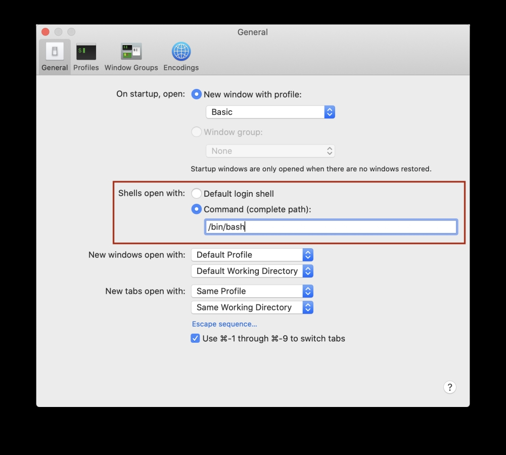

From [https://www.moncefbelyamani.com/which-shell-am-i-using-how-can-i-switch/](https://www.moncefbelyamani.com/which-shell-am-i-using-how-can-i-switch/)


# Which Shell Am I Using? How Can I Switch?

Updated Mar 13, 2022


* [mac](https://www.moncefbelyamani.com/tags/mac/)
*  [terminal](https://www.moncefbelyamani.com/tags/terminal/)
*  [zsh](https://www.moncefbelyamani.com/tags/zsh/)
*  [bash](https://www.moncefbelyamani.com/tags/bash/)
*  [homebrew](https://www.moncefbelyamani.com/tags/homebrew/)
*  [beginner](https://www.moncefbelyamani.com/tags/beginner/)


## Finding your current shell

Starting with macOS Catalina (10.15), Apple set the default [shell](https://en.wikipedia.org/wiki/Shell_(computing)) to the [Z shell](https://en.wikipedia.org/wiki/Z_shell) (zsh). In previous macOS versions, the default was [Bash](https://en.wikipedia.org/wiki/Bash_(Unix_shell)).

Each shell supports a configuration file in your macOS [Home](https://www.moncefbelyamani.com/home-is-where-the-heart-is/) folder that gets read every time you open a new terminal window (or tab). This allows the shell environment to be set up properly with your preferences, and so that the tools you depend on are ready to use.

In `zsh`, the configuration file is `~/.zshrc`. In `bash`, it’s `~/.bash_profile`. Some people might tell you to add things to your `~/.bashrc`. Thank them for their help, and teach them that `.bashrc` does not get read automatically on a Mac when you open up a new shell window.

If you’re not sure which shell you’re using, there are a couple of ways to find out. One is to run this command:
```bash

```

It works in `bash` and `zsh`, but not in `fish`. Here’s a trick I use that should work in all shells. Type any bogus command that you know doesn’t exist, for example:
```bash

```

The first word in the error message should be the name of the shell. In bash, you would see this:
```bash

```

In zsh:
```bash

```

And in fish:
```bash

```


## **Changing shells**

If you want to switch between shells to explore the differences, or because you know you want one or the other, use these commands:


### **Switch to bash**

```bash

```

### **Switch to zsh**

```bash

```

_What the <code>$()</code> syntax does is it runs what’s inside the parentheses (such as <code>which bash</code>), saves the output, and passes it to <code>chsh -s</code>. This is convenient when you don’t know the exact path to the <code>bash</code> or <code>zsh</code> command.</em>

This will prompt you for your macOS password. For the change to take effect, you need to open a new terminal tab, or quit and restart your terminal app.


### **Important Note**

When you switch shells, if you expect to have the same configuration, make sure to copy the contents of `~/.bash_profile` into `~/.zshrc` or vice versa. Also look out for any code that is not compatible with both shells.

If you’re not sure how to open and edit dotfiles, or hidden files (those with filenames that start with a period, like `.zshrc`), read my [guide on opening hidden files on your Mac](https://www.moncefbelyamani.com/5-ways-to-open-hidden-files-on-your-mac/).


#### **Possible error scenario**

If you get a message about a `non-standard shell`, that means that your shell is not listed in `/etc/shells`. This can happen after installing a shell with Homebrew, which is a reasonable thing to do because you can get a newer version than the one that came with macOS.

To make macOS aware of the Homebrew version of a shell, it needs to be added to `/etc/shells`. Here’s how you would safely add Homebrew’s `zsh`:

Find the path of the Homebrew `zsh`:
```bash

```

Open `/etc/shells` in Sublime Text, or another code editor, but not TextEdit:
```bash

```

Copy and paste the output of `which zsh` at the bottom of `/etc/shells` and save the file. This will prompt you for your macOS password. Run the `chsh -s` command again, and this time it should not complain. Remember to open a new tab to see the new shell.


## **Alternative**

Another way to change shells is via the Terminal app preferences, by selecting the “Command (complete path)” radio button in the “Shells open with:” section as shown in the screenshot below:





Note that this does not change your default login shell, which you can check by running `echo $SHELL`. You can test this by following these steps:

Set your login shell to `zsh`:
```bash

```

At the top of your `~/.zshrc`, add this line:
```bash

```

At the top of your `~/.bash_profile`, add this line:
```bash

```

If the file doesn’t exist, you can create it with `touch`:
```bash

```

Update your Terminal preferences to open the shell with the command `/bin/bash`, as shown in the screenshot above.

Quit and restart Terminal.

You should see “hello from bash”, but if you run `echo $SHELL`, you will see `/bin/zsh`.

I’m not sure if this affects anything while developing locally, so I would stick to the default settings and use `chsh -s` to switch shells.

If you’re not sure how to open and edit dotfiles, or hidden files (those with filenames that start with a period, like `.zshrc`), read my [guide on opening hidden files on your Mac](https://www.moncefbelyamani.com/5-ways-to-open-hidden-files-on-your-mac/).
