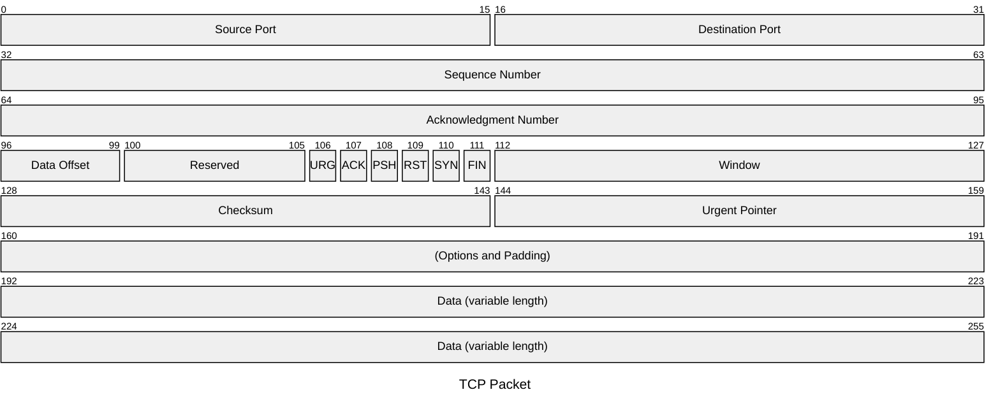
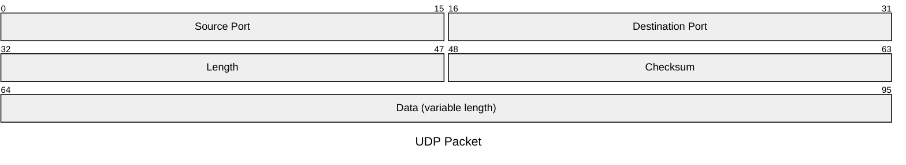
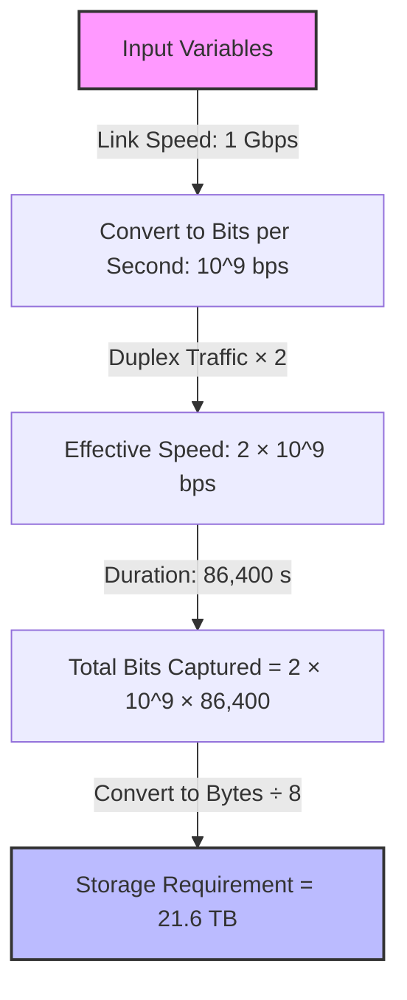

## Packet Diagrams

### TCP Packet

```mermaid
---
title: "TCP Packet"
---
packet-beta
0-15: "Source Port"
16-31: "Destination Port"
32-63: "Sequence Number"
64-95: "Acknowledgment Number"
96-99: "Data Offset"
100-105: "Reserved"
106: "URG"
107: "ACK"
108: "PSH"
109: "RST"
110: "SYN"
111: "FIN"
112-127: "Window"
128-143: "Checksum"
144-159: "Urgent Pointer"
160-191: "(Options and Padding)"
192-255: "Data (variable length)"
```

### UDP Packet

```mermaid
---
title: "UDP Packet"
---
packet-beta
0-15: "Source Port"
16-31: "Destination Port"
32-47: "Length"
48-63: "Checksum"
64-95: "Data (variable length)"
```

## Calculate PCAP storage requirements

```mermaid
graph TD
    A[Input Variables] -->|Link Speed: 1 Gbps| B[Convert to Bits per Second: 10^9 bps]
    B -->|Duplex Traffic × 2| C[Effective Speed: 2 × 10^9 bps]
    C -->|Duration: 86,400 s| D[Total Bits Captured = 2 × 10^9 × 86,400]
    D -->|Convert to Bytes ÷ 8| E[Storage Requirement = 21.6 TB]
    style A fill:#f9f,stroke:#333,stroke-width:2px
    style E fill:#bbf,stroke:#333,stroke-width:2px
```
